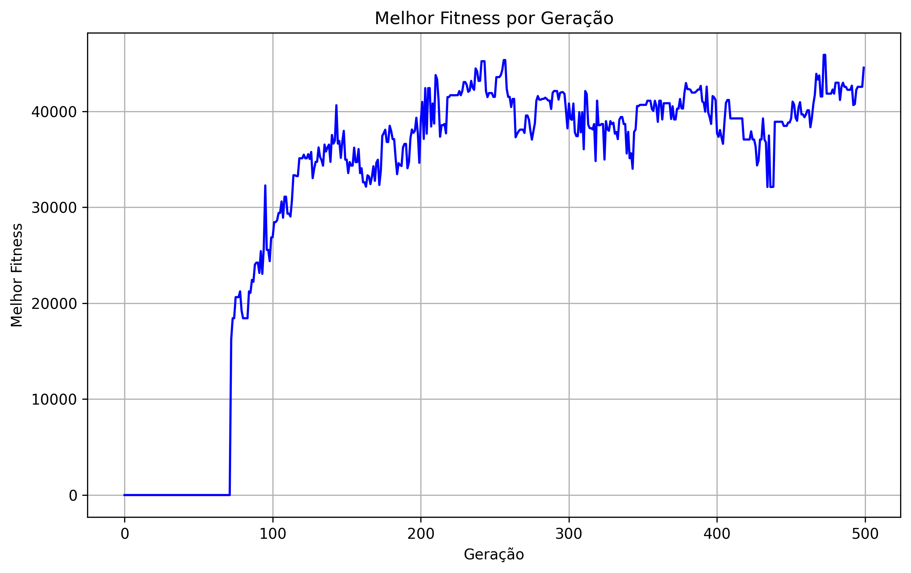

# 🧬 Carga Evolutiva: Otimização de Carga com Algoritmo Genético

Este projeto implementa um **algoritmo genético** sem bibliotecas externas para resolver um problema de otimização de carga em transporte. Ele busca encontrar a melhor combinação de produtos para transportar, respeitando um limite de espaço e maximizando o valor total da carga.

## 📌 Descrição

O projeto utiliza uma população de indivíduos (soluções candidatas), onde cada indivíduo representa uma combinação de produtos a serem transportados. O algoritmo evolui através de várias gerações, aplicando os seguintes passos:

1. **Avaliação** da aptidão (fitness) de cada indivíduo com base no valor total e no espaço ocupado.
2. **Seleção** dos melhores indivíduos para reprodução utilizando o método da roleta viciada.
3. **Cruzamento (Crossover)** para gerar novos indivíduos usando um ponto de corte gerado aleatoriamente.
4. **Mutação** para manter a diversidade da população.

O objetivo é encontrar a combinação de produtos que maximize o valor total transportado sem exceder o limite de espaço.

---

## 🚀 Execução do Projeto

### **1. Pré-requisitos**

- **Python 3.x** instalado.
- Servidor **MySQL** configurado com uma base de dados produtos.
- Biblioteca mysql-connector-python instalada.

Para instalar a biblioteca:

```bash
pip install mysql-connector-python
```

### **2. Estrutura dos Arquivos**

```
.
├── main.py                # Código principal para executar o algoritmo genético
├── Individuo.py           # Classe Individuo
├── Populacao.py           # Classe Populacao
├── Produto.py             # Classe Produto
└── mysql_connection.py    # Conexão com o banco de dados MySQL
```

### **3. Banco de Dados**

Certifique-se de ter uma tabela `produtos` no MySQL com a seguinte estrutura:

```sql
CREATE TABLE produtos (
    id INT AUTO_INCREMENT PRIMARY KEY,
    nome VARCHAR(255),
    espaco FLOAT,
    valor FLOAT,
    quantidade INT
);
```

Insira alguns produtos para teste:

```sql
INSERT INTO produtos (nome, espaco, valor, quantidade) VALUES 
('Produto A', 0.5, 100, 3),
('Produto B', 1.0, 300, 2),
('Produto C', 0.3, 150, 5);
```

### **4. Executar o Código**

```bash
python main.py
```

---

## 📊 Gráfico do Melhor Fitness por Geração

O código gera um gráfico mostrando o progresso do melhor fitness em cada geração. O gráfico será salvo como `melhor_fitness_por_geracao.png` e exibido ao final da execução.

Exemplo de gráfico gerado:



---

## 🔍 Resultados das Execuções

### **Execução 1**

- **Melhor Fitness**: R$48.464,03
- **Produtos Transportados**: ['Iphone 6', 'Iphone 6', 'Iphone 6', 'Iphone 6', 'Iphone 6', 'TV 55', 'TV 50', 'TV 50', 'TV 50', 'TV 42', 'TV 42', 'TV 42', 'TV 42', 'Notebook Dell', 'Microondas Electrolux', 'Microondas LG', 'Microondas LG', 'Microondas LG', 'Microondas LG', 'Microondas Panasonic', 'Microondas Panasonic', 'Notebook Asus']
- **Geração do Melhor Fitness**: 375

### **Execução 2**

- **Melhor Fitness**: R$45.892,18
- **Produtos Transportados**: ['Iphone 6', 'Iphone 6', 'Iphone 6', 'Iphone 6', 'Iphone 6', 'TV 55', 'TV 55', 'TV 50', 'TV 50', 'TV 50', 'TV 42', 'TV 42', 'Notebook Dell', 'Microondas LG', 'Microondas Panasonic', 'Microondas Panasonic', 'Notebook Asus']
- **Geração do Melhor Fitness**: 472

### **Execução 3**

- **Melhor Fitness**: R$47.426,18
- **Produtos Transportados**: ['Iphone 6', 'Iphone 6', 'Iphone 6', 'Iphone 6', 'Iphone 6', 'TV 55', 'TV 50', 'TV 50', 'TV 50', 'TV 42', 'TV 42', 'TV 42', 'TV 42', 'Notebook Dell', 'Microondas LG', 'Microondas LG', 'Microondas LG', 'Microondas Panasonic', 'Notebook Asus']
- **Geração do Melhor Fitness**: 491

---

## 🛠️ Detalhes Técnicos

- **Número de Gerações**: 500
- **Tamanho da População**: 20
- **Taxa de Mutação**: 1%
- **Limite de Espaço**: 3.0

---

## ⚠️ Limitações do Projeto

- **Número de Produtos**: 47 produtos diferentes disponíveis para seleção.
- **Limite de Espaço**: Apenas 3 metros cúbicos de capacidade máxima.
- **Complexidade Computacional**: Rodar todas as combinações possíveis em busca da melhor solução levaria um tempo considerável para um computador comum. No entanto, o algoritmo genético encontra uma solução otimizada em menos de **3 segundos**.

## 🔢 Número Total de Combinações

Dado um conjunto de **49 produtos**, o número total de combinações possíveis é a soma de todas as combinações de tamanho **r** entre **1** e **49**. Isso pode ser calculado como:

Soma das combinações = **2 elevado a 49 menos 1**

Resultado:

2 elevado a 49 é aproximadamente **562 trilhões (562.949.953.421.312)**.

Portanto, o número total de combinações possíveis é aproximadamente **562 trilhões**.

## 🕒 Tempo de Execução Estimado

Supondo que o algoritmo leve **1 microssegundo (0,000001 segundo)** para avaliar cada combinação, o tempo total necessário para examinar todas as combinações possíveis é:

562.949.953.421.312 combinações × 0,000001 segundo por combinação ≈ **562.949.953 segundos**

Convertendo para unidades maiores:

- **Em minutos:** aproximadamente 9.382.499 minutos  
- **Em horas:** aproximadamente 156.375 horas  
- **Em dias:** aproximadamente 6.515 dias  
- **Em anos:** aproximadamente 17,8 anos  

### ⚠️ Conclusão

Analisar todas as combinações possíveis de **49 produtos** com força bruta levaria cerca de **17,8 anos**, mesmo com processamento otimizado. Este cenário destaca a necessidade de algoritmos heurísticos, como os **algoritmos genéticos** para resolver o problema em um tempo viável. Por exemplo, uma execução desse algoritmo não levou nem 3 segundos para gerar os resultados apresentados. Embora esses resultados possam não ser os absolutamente melhores, eles são ótimos e suficientemente bons para a maioria dos casos práticos.

---

## 📝 Autor

- **Fabio Oliveira**
